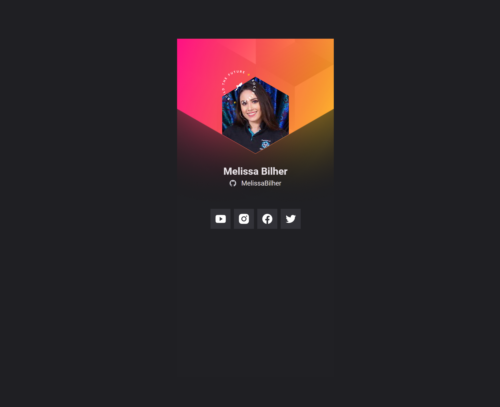

# NLW Mission 2022

> NLW Origin

 Criação de um crachá digital.

Projeto desenvolvido no evento NLW Mission - Origin 2020, onde foi criado um crachá virtual/cartão virtual com os dados e redes sociais do usuário. 

[Clique aqui para acessar](melissabilher.github.io/NLW/)

## 🛠 Tecnologias

- HTML
- CSS
- JavaScript
- Git e Github
